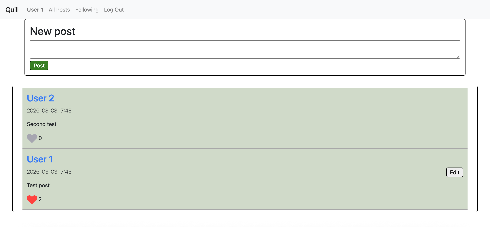
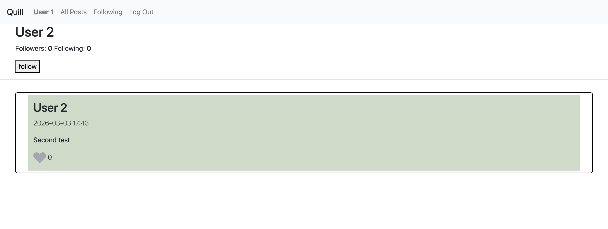

## QUILL

---
### Intro
Quill is a full stack app made using native JavaScript with HTML/CSS for the front end and Django and python for the back end.
Coding features:
- The ability to make secure accounts
- Make posts and see the home page update without re-loading the page
- Edit and like fields that update responsively
- Ability to follow users and query posts to only feature followed users

---
### Run-Instructions
For now you need to download the repository have django installed, then run the line:
ios: python3 manage.py runserver
windows: python manage.py runserver
